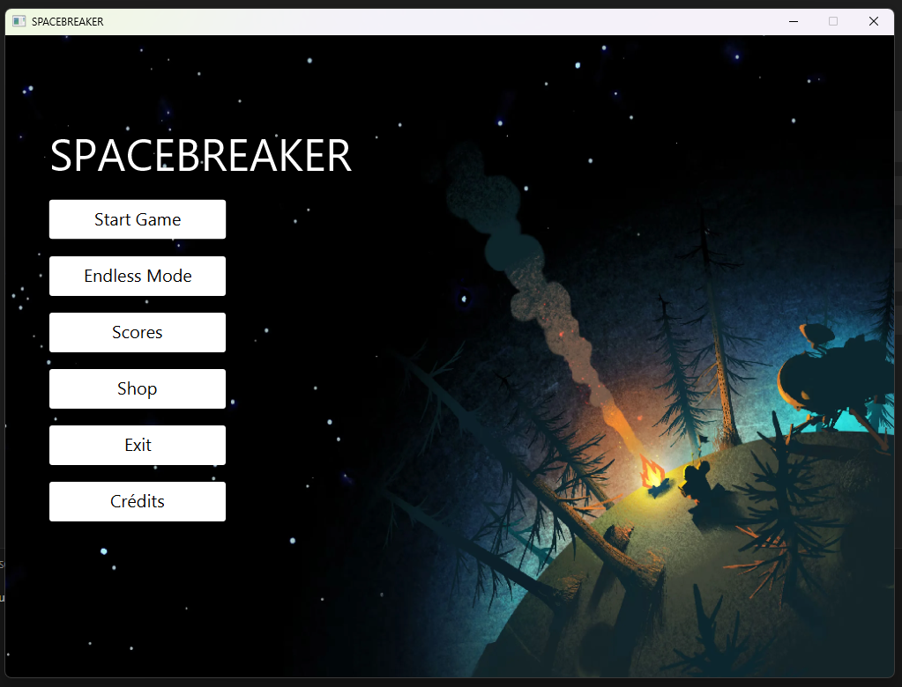
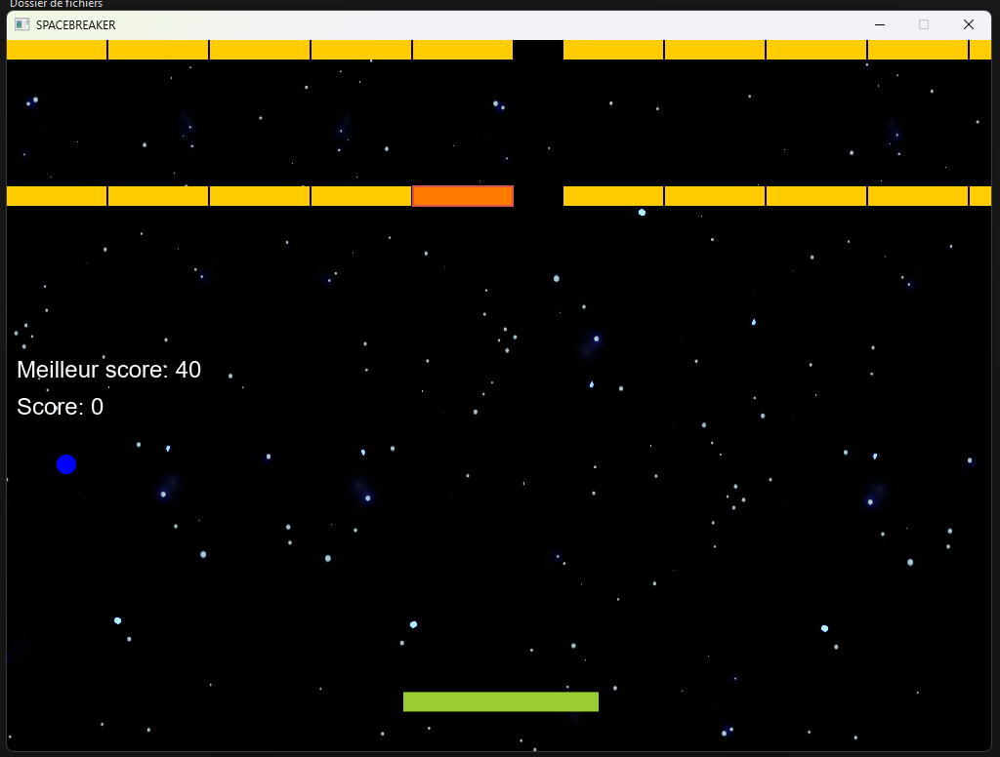
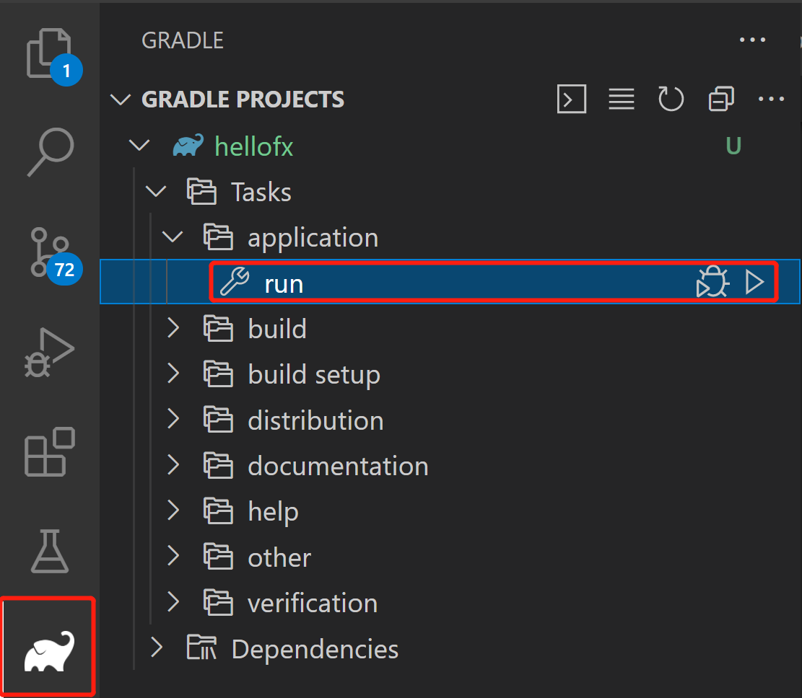

# BreakOut !

This repository hosts a classic **Brick Breaker game**, developed as a collaborative school project. 
It serves as a practical demonstration of fundamental game development principles, the **MVC (Model-View-Controller) architectural pattern**, and the robust capabilities of the **Java** ecosystem.

**Key Technologies & Features:**
* **Core Logic:** Implemented purely in **Java**.
* **Graphical User Interface (GUI):** Built using **AWT** and **Swing**.
* **Build Automation:** Managed efficiently with **Gradle**, handling dependencies and compilation.
* **Data Handling:** Utilizes the **JSON library**.
* **Continuous Integration/Deployment:** Integrates **GitHub CI/CD** to run automated tests and ensure code quality on every commit.

This project demonstrates strong skills in **Object-Oriented Programming (OOP)**, **game loop management**, **collision detection**, and **automated testing practices**.

The screenshots don't look like munch, but there are many features in the game :)

## Build instructions

This project is based on JavaFX. 
The sources are organized to be built using Gradle within Visual Studio Code.

This is derived from, non-modular sample:
https://github.com/openjfx/samples/tree/master

Download [JDK 17 or later](http://jdk.java.net/) for your operating system. Make sure `JAVA_HOME` is properly set to the JDK installation directory.

### Gradle

For the first time only:

- Make sure you have installed following extensions in your Visual Studio Code:
  - [Extension Pack for Java](https://marketplace.visualstudio.com/items?itemName=vscjava.vscode-java-pack)
  - [Gradle for Java](https://marketplace.visualstudio.com/items?itemName=vscjava.vscode-gradle)

To run the JavaFX application, you can open the `Gradle Projects` explorer, expand `hellofx` > `Tasks` > `application` and run the Gradle task: `run`

Or alternatively run from terminal:

On Linux or Mac run:

    cd IDE/VSCode/Non-Modular/Gradle/hellofx
    ./gradlew run

On Windows run:

    cd IDE\VSCode\Non-Modular\Gradle\hellofx
    .\gradlew.bat run
