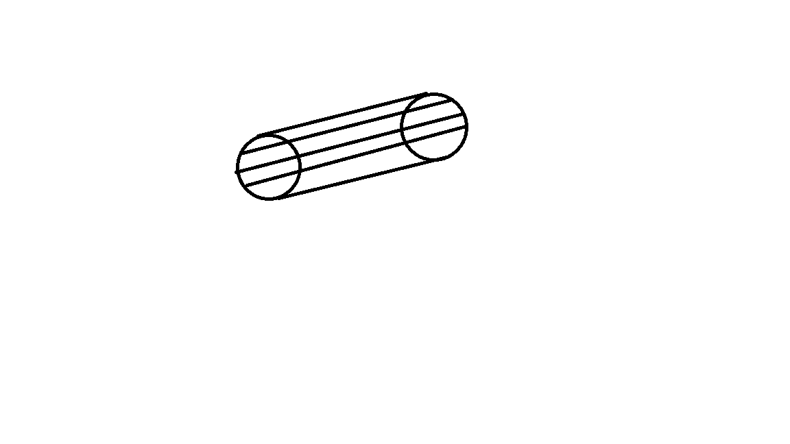
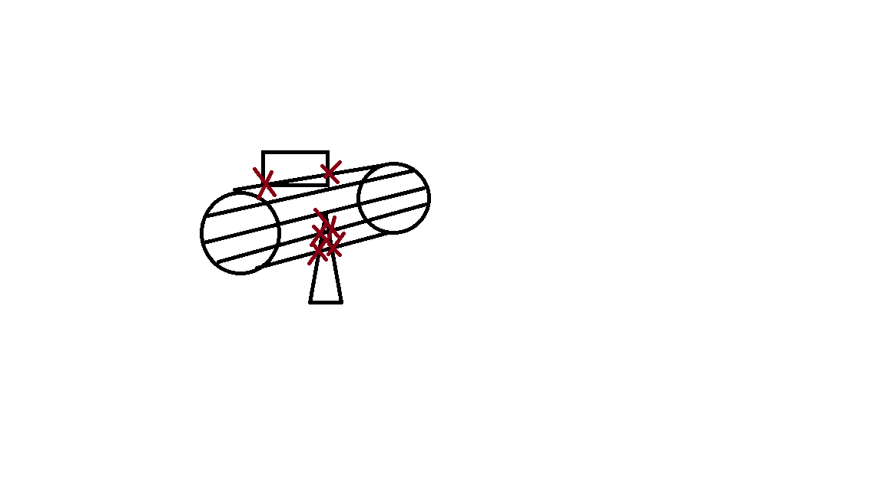

a chaque frame:

le programme calcule la prochaine position de la balle puis trace des lignes qui parte de balle initiale vers la balle suivante:

puis il trouve recherche les intersections entre des face et l'une de ces ligne:

plus qu'a calculer quelle intersection est la plus proche du centre de la balle initiale. Et a recupérer face correspondante a l'intersection.

avec cette face on peut calculer le nouveau vecteur de la balle avec le vecteur normal associer a la face.